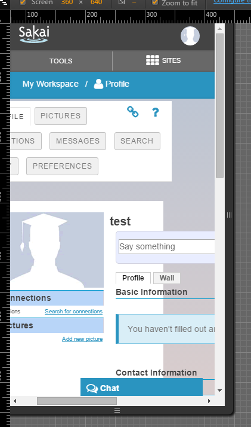
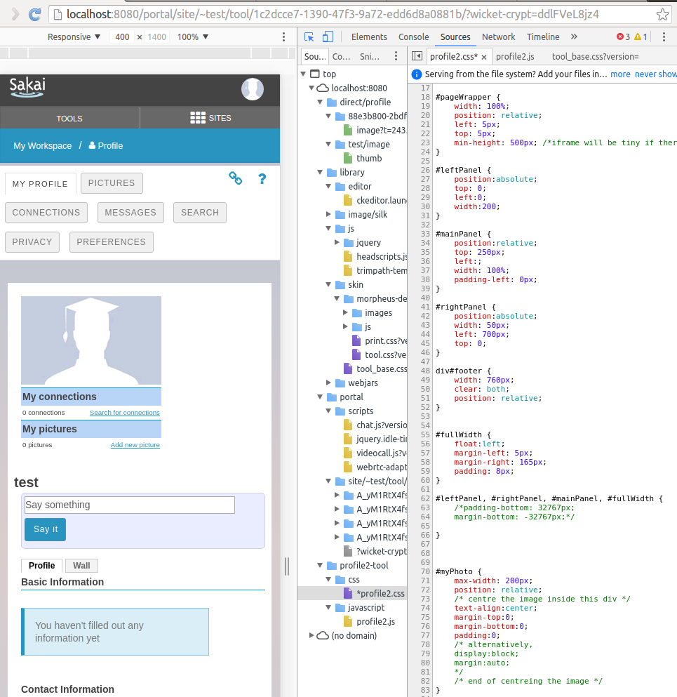

## Bug Fix Report:

The bug I set out to fix was https://jira.sakaiproject.org/browse/SAK-30408, a CSS style issue with the profile page in which
the picture box seems to push the rest of the text on the page out of the way.

Here is an example of the bug as demonstrated in a simulated mobile browser:

## Diagnosis:
Having absolutely zero CSS and HTML experience, working on this bug, even though it was very simply, was pretty confusing for me.

Opening up the dev editor in Chromium:

I found, using the elements tab, that the problem area of the site consists of three elements within "portletBody", the "leftPanel, mainPanel, and rightPanel. It appears that the leftPanel is fixed to a minimum size that cannot scale with a mobile device, and is also fixed to be to the left of the mainPanel. So while all is fine and good with a full size display, when going to mobile the leftPanel pushes the mainPanel, in which most of the site content is, off to the right of the screen. 

This was confirmed in the CSS for the page, profile2.css, which shows:

The leftPanel is fixed in absolute position with a miniumim width of 200px, and the mainPanel is fixed to the right of it.

## Potential Fix:
For me this is where it is tricky, as I have no experience at all with web development. On a basic level, it seems that, at least when using mobile, the profile picture pox (leftPanel) needs to appear on top of the rest of the content. I can see two ways to do this. One would be to find a way to force the leftPanel to appear atop the mainPanel, or to move the content if leftPanel into mainPanel and eliminate leftPanel. There would also need to be some code to detect if mobile is being used and make these changes when it is. I have no idea if this would be good design practice, and it seems to me that it would not be.

I did end up coming up with a somewhat palatable fix, in which the profile pciture frame was moved on top of the main panel instead of on top of it. I did a couple of changes to do this. I set the pageWrapper width to 100% instead of a fixed pixel count, which prevents the screen overrun. Next I set the mainPanels' relative position to be 250px below and 0px to the left of the leftPanel. The result is a page that isn't as broken, but does not represent the original style of the page. 

Here is the fix on mobile:

Here it is on desktop:

## Submitting a Pull Request (Why I didn't):
From the start of working on this bug I had reservations about submitting a pull request to master, as my fix did not represent the original page style on desktop, and I do not have faith in my CSS/HTML skills. While it looks OK to me, I am worried that it will just be a thorn in the side of Sakai's dedicated developers.

However, this turned out not to end up being an issue. As I was working on my bug I was checking my JIRA to see if it had been resolved, and as of earlier today it had not been touched. However, when I went to reproduce my bug on the nightly, it turns out it had been fixed. I can assume that another bug report had been created and fix at some point between my inital report, though it's a little frustrating that it was never linked to my bug report. As a result, I went ahead and closed my JIRA report so that no one will have to worry about it later. Looking at the CSS file of the fixed page, it appears that the developer gutted the "panels", and instead used another method of alignment that results in the correct behavior. I do not believe I would have been able to figure out this fix in a reasonable amount of time.

## Conclusion:
While I regret not being able to submit a pull request to master, I think avoiding doing so was the correct option. In diagnosing the bug I was able to get an introductry understanding of CSS of which I had no prior experience, and was able to create a palatable fix that I could have commited and submitted as a bug fix. However, I do not believe submitting a bug fix I knew was sub-par to the master project would have been productive for the sakai community. If I were to get more involved in fixing these types of bugs, I would seek mentorship from experienced developers in order to do it properly.

