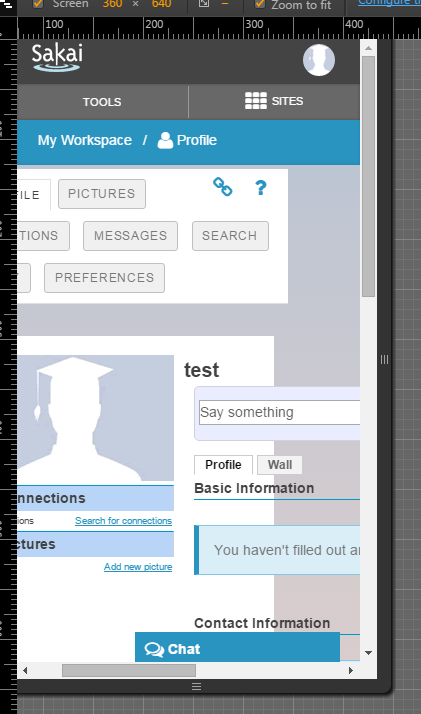

Bug Fix Report:

The bug I set out to fix was https://jira.sakaiproject.org/browse/SAK-30408, a CSS style issue with the profile page in which
the picture box seems to push the rest of the text on the page out of the way.

Here is an example of the bug as demonstrated in a simulated mobile browser:

Diagnosis

Potential Fix:

Ultimate Result:
As I was working on my bug, I was checking my JIRA ticket to make sure that it hadn't been 

**WHy this is ok, I'm very inexperienced with CSS and would likely have just caused more problems w/regression

